# TriangleMeshCreator

[](https://travis-ci.org/richelbilderbeek/TriangleMeshCreator)

TriangleMeshCreator creates all the files for a three-dimensional mesh for use with OpenFOAM.

There are a desktop and console version supplied to demonstrate how to do this.
For those, you will need to supply a 2D mesh, a height, layer height and a percentage
of cells that are randomly removed.

TriangleMeshCreator, however, is intended to be used as a library.
The most important class in `ribi::trim::Dialog`, where you can
supply your own sculpting function. This sculpting function determines which cells will be removed.

## Installation

```
git clone https://github.com/richelbilderbeek/RibiClasses
git clone https://github.com/richelbilderbeek/RibiLibrary
git clone https://github.com/richelbilderbeek/TriangleMeshCreator
git clone https://github.com/richelbilderbeek/Triangle
cd TriangleMeshCreator
qmake TriangleMeshCreatorConsole.pro
make
qmake TriangleMeshCreatorDesktop.pro
make
```

## Usage of desktop version

### Start the main program

In the menu, choose 'Start'.

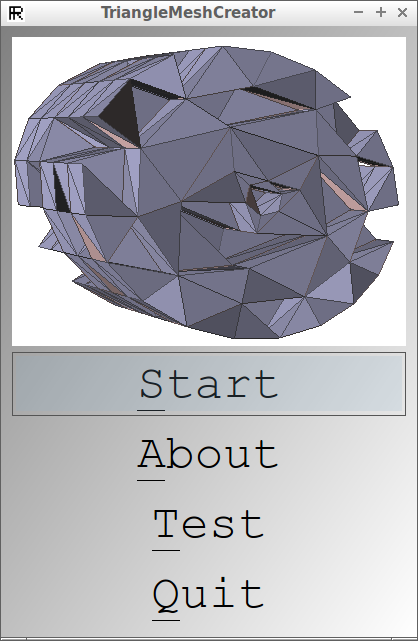

### Create a 2D mesh

In the 'Create 2D mesh', you can create a 2D mesh in WKT.
This 2D (untriangulated) mesh will serve as the base for your 3D object
The values are in meters.

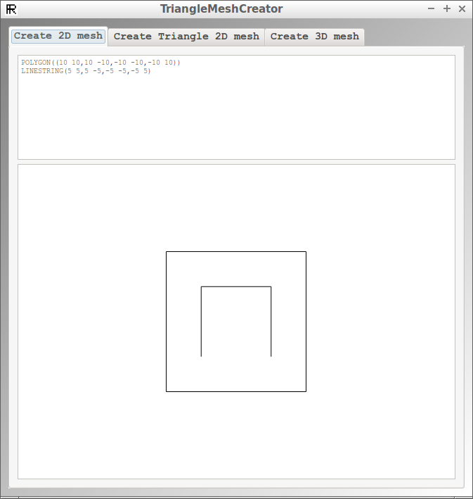

When done, go to the tab 'Create Triangle 2D mesh'

### Create a triangulated 2D mesh

In the 'Create Triangle 2D mesh', you can create a triangulated 2D mesh
for your current untriangulated one.

You can change the two triangulation parameters here:

 * Min angle (degrees): the minimum angle to triangles must have. The higher this value (that is, 
   closer to 30), the longer it takes the program to create a satisfactoy mesh. It may also fail. 
   If this is the case, decrease this angle. The default value of 20 degrees is usually fine.
 * Max area (m2): the maximum area a triangle may have in square meters. The smaller this value, the
   more triangles may be created. This will increase the OpenFOAM analysis resolution, 
   at the cost of that same analysis taking longer to complete. 

Click 'Create Triangle 2D mesh' to view the triangulated version of your mesh.


When done, click on the tab 'Create 3D mesh'

### Create a 3D mesh

In the 'Create 3D mesh', you can create a 3D mesh from your triangulated 2D mesh.

This is done by specifiying:

 * the number of layers
 * the height of each layer in meters
 * the fraction of cells that are randomly sculpted away
 * the type of vertical faces

This 3D mesh will serve as the base for your 3D object
The values are in meters.

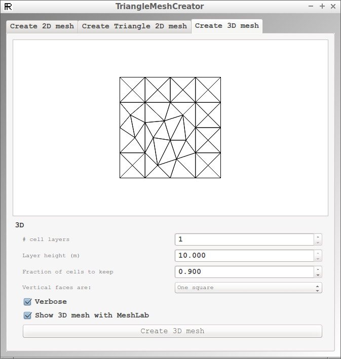

When done, click on the button 'Create 3D mesh'. It will create all OpenFOAM files in the folders of your executable.

If the checkbox 'Show in meshlab' was checked, meshlab will show the mesh:

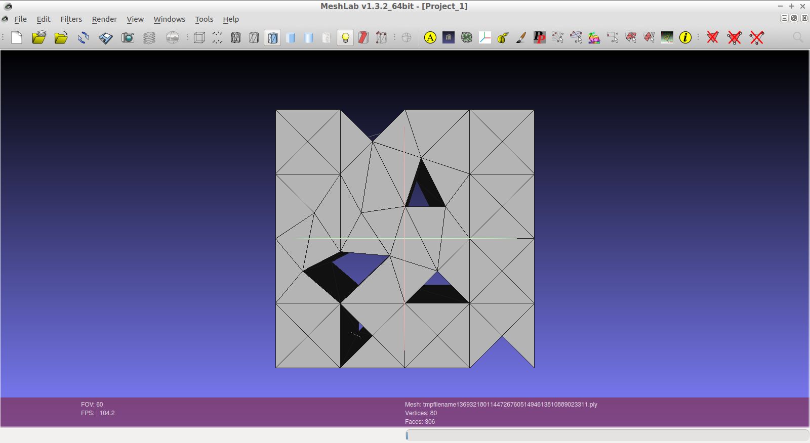

## Usage of console version

The console version is used from the command-line:

```
ToolTriangleMeshCreatorConsole --help
```

Every option is matched in the desktop version by a widget of the same name.

A light example is:

```
TriangleMeshCreator --layer_height 1 --WKT "POLYGON((10 10,10 -10,-10 -10,-10 10))" --strategy 1 --n_layers 10 --fraction 0.9 --triangle_max_area 10.0 --triangle_min_angle 20.0
```

## Screenshots

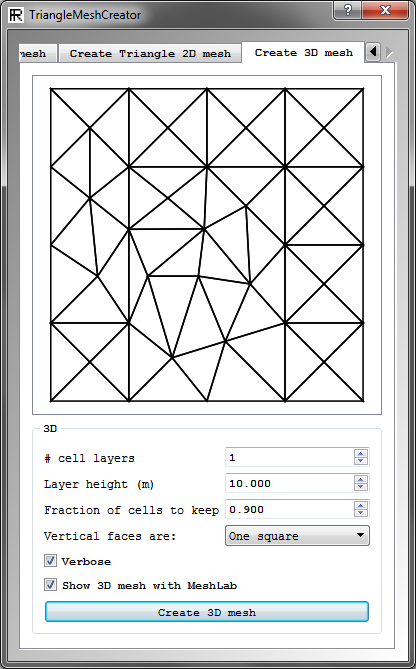

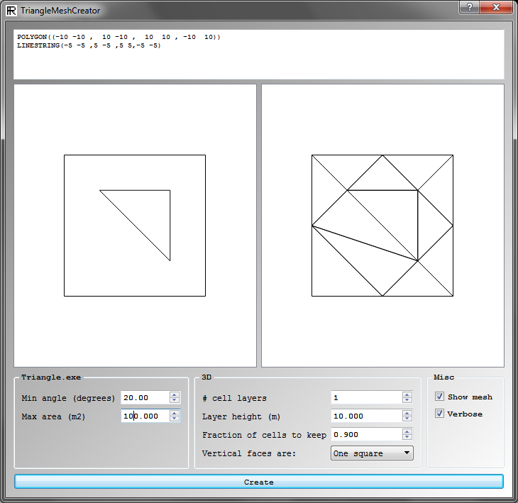   

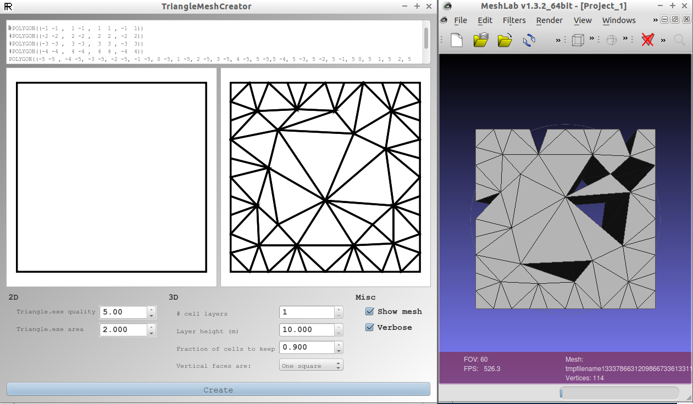  

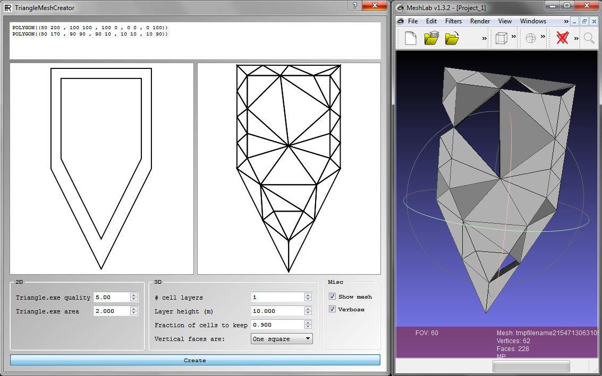 

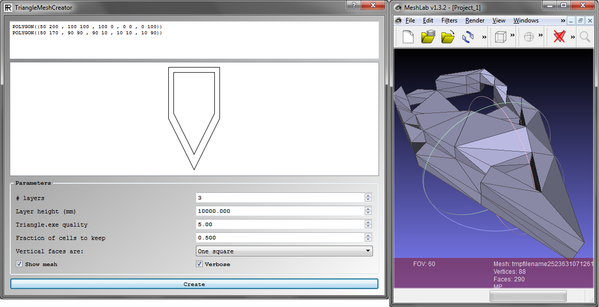   

   

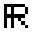

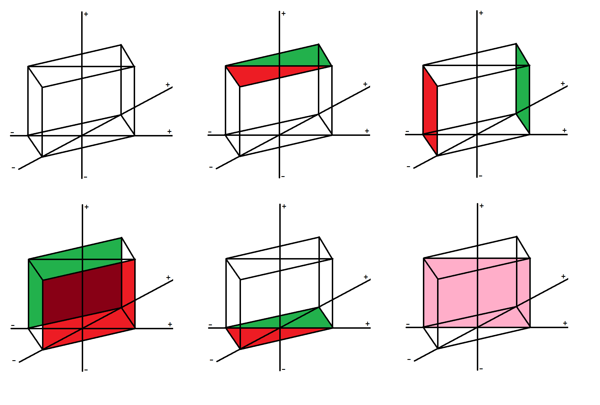

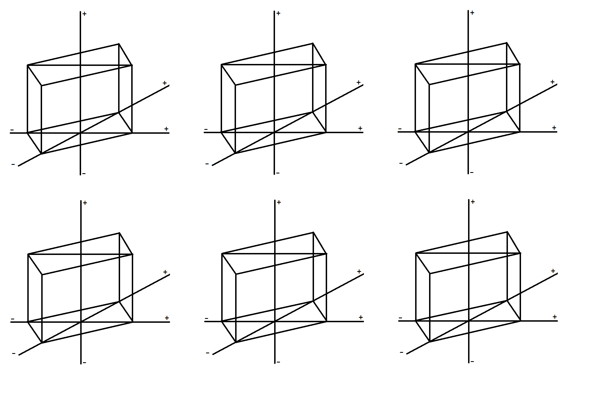

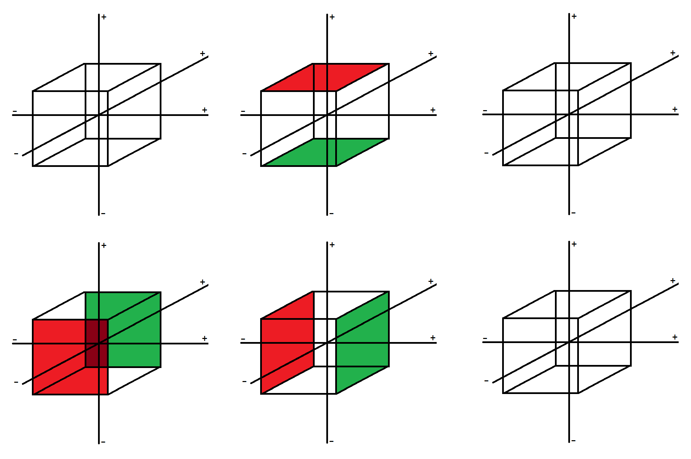

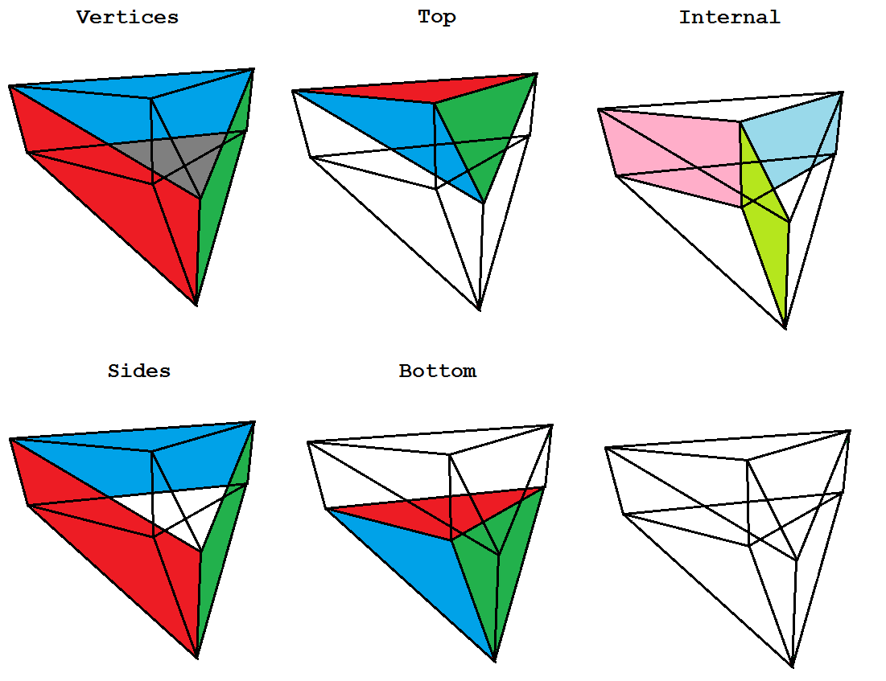

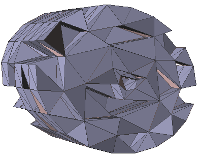

